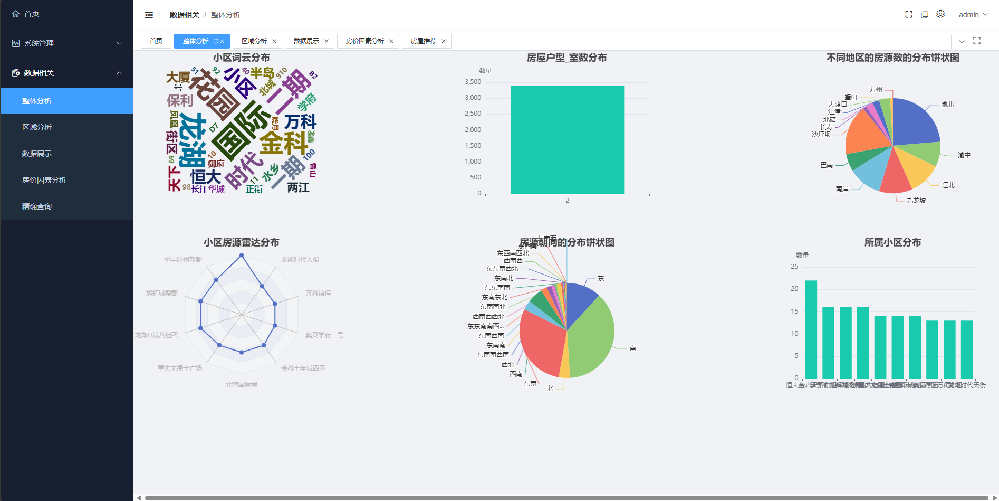
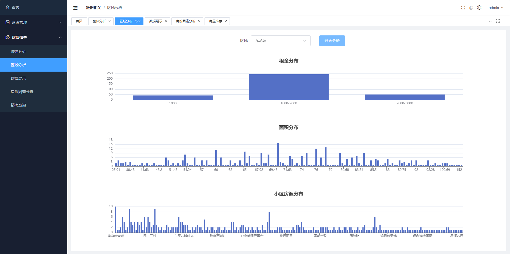
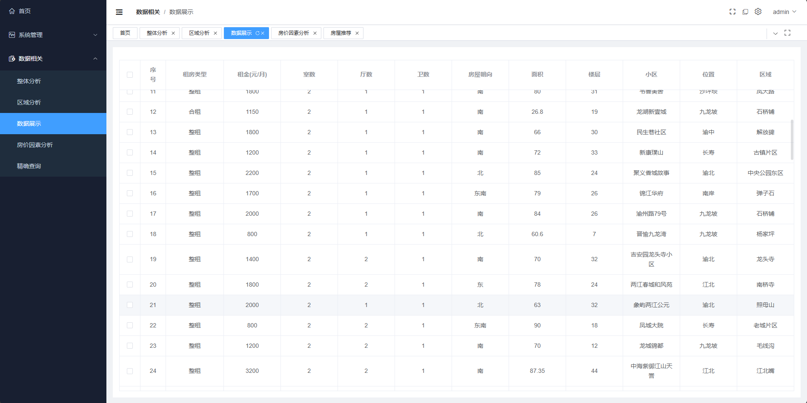
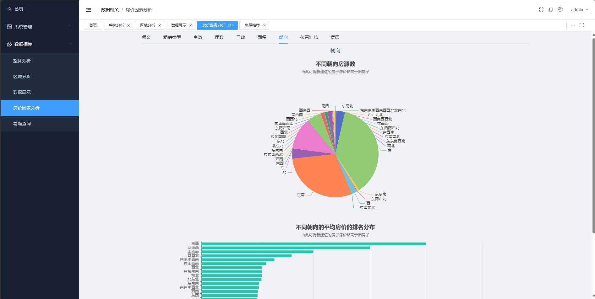
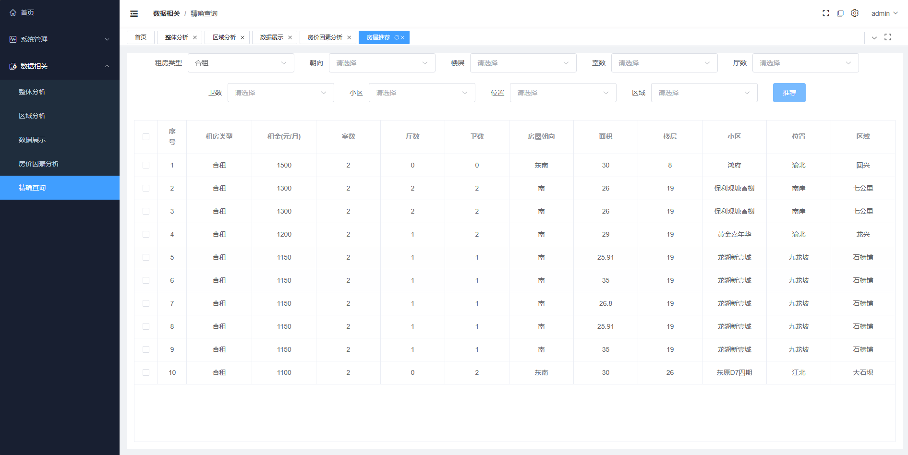

## 计算机毕业设计django+大模型租房推荐系统 租房可视化 租房大屏可视化 租房爬虫 spark 58同城租房爬虫 房源推荐系统

## 要求
### 源码有偿！一套(论文 PPT 源码+sql脚本+教程)

### 
### 加好友前帮忙start一下，并备注github有偿纯python租房可视化
### 我的QQ号是2827724252或者798059319或者 1679232425或者微信:bysj2023nb 或bysj1688

# 

### 加qq好友说明（被部分 网友整得心力交瘁）：
    1.加好友务必按照格式备注
    2.避免浪费各自的时间！
    3.当“客服”不容易，repo 主是体面人，不爆粗，性格好，文明人。
## 介绍
环境: python3、flask、mysql、vue

简介: 需要定制项目+付费源码查看主页【所有成品支持定制化修改、不用担心撞车】

A-基于大数据的城市租房数据分析与可视化设计+大屏

项目使用flask+vue前后端分离开发，使用echats实现可视化和大屏

## 演示视频
https://www.bilibili.com/video/BV1a1SLYwEam/

## 演示截图

